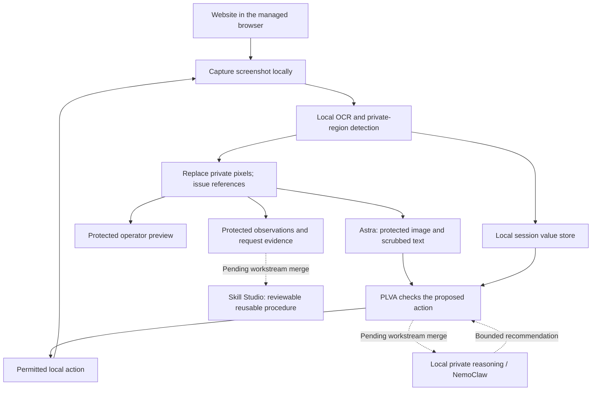

# PLVA — Private AI Assistance for Client Work

**Protecting client information is the central purpose of PLVA.** The project lets an AI assistant help with browser workflows while keeping detected private details behind a local privacy boundary. The assistant receives protected screenshots and opaque references; permitted uses of the underlying client values happen locally, under checks enforced by PLVA.

Client names, email addresses, phone numbers, shipping details, and credentials often appear in the same screens an assistant needs to understand. PLVA separates the information needed to plan a task from private values that should remain under the user's control. Its main contribution is the complete privacy path around AI assistance: local detection, screenshot protection, private references, controlled execution, protection of the next observation, and inspectable evidence of what actually reached the provider.

The project brings together three workstreams:

| Workstream | Contribution | Current delivery status |
| --- | --- | --- |
| **PLVA browser privacy + Astra** | Protect observations, retain values locally, enforce permitted actions, and show actual submitted images and provider receipts. | Implemented and running in the integrated Windows browser app; tested on the workflows described below. |
| **Private reasoning + NemoClaw** | Add local reasoning over private information, with a separate isolation/deployment boundary and constrained recommendations. | Implementation work is complete according to the project owner; merge into the combined application is pending. Host setup and combined isolation verification are separate from code completion. |
| **Screenshot-to-skill / Skill Studio** | Turn sanitized workflow evidence into a reusable `SKILL.md`, structured procedure, and fresh inputs for a later run. | Implemented on its workstream branch, with an actual generated skill file; merge and execution through the combined runner are pending. |

**The workstreams have been built. The remaining delivery step is merging them into one application and validating their connections.** The browser core can be used now. The NemoClaw/private-reasoning and skill sections describe the completed workstream implementations and their integration boundaries; they do not claim that an unmerged combined run has already been verified.

Status documented September 8, 2026. Earlier planning documents describe earlier milestones and may still call these workstreams future work. This README incorporates the project owner's latest completion update while keeping measured evidence tied to the component that produced it.

**Publication scope:** this README documents the current development integration. The latest protected-history/dashboard updates and additional regression fixtures are present in the local integration but are not all published on `main` yet. This documentation update does not merge application code. A fresh checkout has the published browser core and password detector correction; the full feature set and expanded test commands below require the corresponding integration changes.

## Contents

- [Why client privacy comes first](#why-client-privacy-comes-first)
- [What is implemented](#what-is-implemented)
- [How the privacy boundary works](#how-the-privacy-boundary-works)
- [What stays local and what reaches AI](#what-stays-local-and-what-reaches-ai)
- [Private information supported today](#private-information-supported-today)
- [Run the browser app](#run-the-browser-app)
- [Test it yourself, step by step](#test-it-yourself-step-by-step)
- [Protected previews, history, and receipts](#protected-previews-history-and-receipts)
- [NemoClaw and local private reasoning](#nemoclaw-and-local-private-reasoning)
- [The created skill file and Skill Studio](#the-created-skill-file-and-skill-studio)
- [Merge and combined integration](#merge-and-combined-integration)
- [Verification and test commands](#verification-and-test-commands)
- [Architecture, files, and local API](#architecture-files-and-local-api)
- [Troubleshooting and operating limits](#troubleshooting-and-operating-limits)
- [Reference implementation and further reading](#reference-implementation-and-further-reading)

## Why client privacy comes first

A useful assistant may need to read a support ticket, find the right form, prepare a replacement, or check that a task has reached the expected result. Those screens can also contain client details that are unnecessary for the assistant's reasoning. Sending a whole unprotected screenshot would expose both kinds of information together.

PLVA introduces a local processing step before the cloud request. It detects supported private information, replaces the corresponding image pixels, and gives the assistant references such as `[EMAIL_1]` or `[ADDRESS_1]`. The assistant can refer to a client value by its role without receiving the detected plaintext value.

The privacy objective continues through execution. A protected screenshot alone is insufficient if a later action, error message, follow-up screenshot, or exported procedure reveals the same information. PLVA therefore handles the observation, text, action, and evidence paths together:

1. **Protect before sending.** Screenshot detection and masking happen on the user's machine before the provider call.
2. **Keep private values local.** The session retains the mapping between an issued reference and its usable value locally.
3. **Check each use.** A reference is resolved only inside a permitted local typing action, after destination checks.
4. **Protect the result again.** A filled field becomes part of the next observation and passes through the same protection path.
5. **Make transmission inspectable.** The operator can inspect the actual submitted image and provider receipt.
6. **Keep learned procedures private.** Reusable skills describe the workflow and bind fresh references instead of carrying client values from an earlier session.

These mechanisms make client-information protection the organizing principle of the project. Browser automation, local reasoning, and reusable skills are built around that principle.

Potential applications include customer support, replacement and fulfillment preparation, contact-record handling, and administrative workflows involving client information. The architecture can be extended to additional information classes and applications. The current detector implements the specific categories and boundaries documented here; it is not a universal classifier for every confidential document or business secret.

## What is implemented

| Capability | What it does | Privacy significance |
| --- | --- | --- |
| Dedicated managed browser | Opens ordinary websites in a visible Microsoft Edge session on Windows. | Gives the privacy runtime a defined capture and action scope. |
| Local screenshot OCR | Reads screenshot pixels using provisioned English OCR assets on CPU. | Raw images do not need a cloud OCR service. |
| Local classification | Recognizes supported email, phone, name, address, and credential patterns/context. | Finds private regions without ordinary sites adding privacy annotations. |
| Opaque image masks | Replaces source pixels and renders reference labels inside the protected bounds. | The image sent onward contains replacement pixels for detected regions. |
| Session references and local value storage | Issues stable references within the privacy session. | The assistant can refer to supported values without seeing them. |
| Checked local typing | Validates the origin, active tab, focused field, and form destination before resolving eligible references. | A token cannot be used freely in an arbitrary destination. |
| Blocked secret references | Refuses secret-token resolution. | Detecting a credential does not make credential entry available to Astra. |
| Outbound text scrubbing | Scrubs known values and supported structured patterns from request text and recorded output. | Protection also covers supported text paths around screenshots. |
| Real Astra integration | Sends protected observations through the Responses API computer tool and records actual responses. | Demonstrates the privacy path around a live provider interaction. |
| Navigation and tab handling | Captures fresh observations after navigation, scrolling, and tab changes. | Protection follows the tested workflow transitions. |
| Stop and failure handling | Stops agent work and prevents sends when observation/protection fails. | A failed protection stage does not fall back to sending the raw image. |
| Operator dashboard | Shows detector state, protected previews, references, activity, and request evidence. | The user can inspect protection and control when AI starts. |
| Protected observation history | Keeps prior protected steps above the latest preview. | The user can review the sequence without replacing the live view. |
| Pixel and provider verification | Checks actual glyph coverage and links submitted bytes to receipts. | Tests examine observable privacy behavior, beyond a success message. |

The latest password-mask correction is also included in the running app. It fixes a case where a `Forgot password?` link was incorrectly selected as the password value while OCR missed small password dots. Local pixel detection now supplements OCR for supported nearby glyph runs. See [the correction report](docs/PASSWORD-MASK-FIX.md).

## How the privacy boundary works



### 1. Capture and recognize locally

The browser runtime captures the selected managed page. The ordinary-site detector accepts PNG bytes and processes the pixels locally. It does not use hidden page values, website-provided privacy labels, or a preloaded list of expected client values to find private content.

The original prepared fixture is a separate path: it uses annotated synthetic fields to exercise the initial workflow. Its success is documented separately from ordinary-site OCR.

### 2. Replace the actual private pixels

The privacy layer validates the detected regions and paints opaque replacements over them. It produces a new PNG plus metadata containing reference tokens, categories, and mask coordinates. Labels are generic and clipped to the mask area.

This is image transformation in the local pipeline. Hiding a value only with a dashboard overlay would not protect an underlying screenshot sent to AI; PLVA submits the transformed image produced by the privacy layer.

### 3. Plan with opaque references

Astra sees the protected interface and can propose an action using an exact reference. For example, it may request entry of `[EMAIL_1]` into the intended contact-email field. The actual email is absent from that detected region in the protected image and is not included in the value-free manifest.

References are scoped to the current session. Their numbers are identifiers, not a ranking or a claim about the content. A new session can assign different numbers.

### 4. Resolve only where permitted

PLVA checks the action locally. Ordinary-site token typing has a deliberately narrow supported surface: eligible text, email, and telephone inputs with suitable contact semantics, on an authorized origin and an acceptable form destination.

The checks include selected-tab state and the actual focused element. Search inputs, URL fields, password fields, GET forms, cross-origin form submissions, secret references, unknown references, and ambiguous targets are refused by the current token-entry boundary. Textareas, contenteditable elements, and iframe contact fields require operator handling.

Opening an origin through the operator control can authorize it for eligible token entry. Agent navigation and redirects do not automatically add that permission. A local reasoning recommendation or a saved skill cannot override these checks.

### 5. Protect every subsequent observation

After an action, the runtime captures and protects the next screenshot before another model request. This includes a field that has just received a permitted value. Unchanged image bytes can reuse cached protection; changed images require fresh detection and protection.

A capture or detector exception is treated as failure. It is not converted into a successful empty mask list, and the raw image is not used as a fallback provider input. Detection misses that do not raise an error are a different limitation, which is why inspecting the protected preview remains useful.

## What stays local and what reaches AI

| Information | Handling in the browser core |
| --- | --- |
| Current raw screenshot | Processed locally and available in the optional operator-only private view; not used as the ordinary-site provider image. |
| Detected plaintext values and OCR discoveries | Kept in local process/session state; not included in the provider manifest. |
| Eligible token-to-value mappings | Resolved locally for permitted actions. |
| Secret references | Protected and blocked from token resolution. |
| Protected screenshot | Can be sent to Astra when a live task is started. Content the detector misses can remain visible. |
| Reference manifest | Supplies categories and opaque references, without the corresponding plaintext values. |
| Task text and supported tool/response text | Scrubbed through the local text boundary before inclusion in the supported request/audit paths. |
| API credential | Used locally to authenticate the provider request; excluded from the recorded payload and model-visible task content. |
| Protected history | Retained in bounded process memory; raw screenshot history is not stored by this feature. |
| Browser profile | Stored locally in the dedicated Edge profile and may retain website login state according to the browser. |
| Reusable skill | Uses procedural instructions and semantic parameters; private inputs must be bound to fresh runtime references. |

The dashboard is a local operator interface. Its state endpoint can contain the current raw frame for the optional private view, so its response is not a sanitized export. The server binds to `127.0.0.1:18080`. Keep this local interface on the machine; the current app is not a multi-user hosted service with dashboard authentication.

The destination website still receives a real value when the user authorizes a permitted local action there. PLVA reduces what the AI provider receives; it does not make the intended destination website unable to see its own form input.

## Private information supported today

| Category | Examples of supported detection | Important detail |
| --- | --- | --- |
| `EMAIL` | Visible email-address patterns. | Small or clipped text can be missed or transcribed incorrectly. |
| `PHONE` | Supported formatted telephone-number patterns. | Coverage depends on the format and screenshot quality. |
| `NAME` | Names with recognized labels or greeting context; locally discovered names in later views. | Arbitrary names in unlabeled prose are not universally recognized. |
| `ADDRESS` | Supported English street patterns and labelled multiline addresses. | Layout and contextual labels affect grouping and coverage. |
| `SECRET` | Supported credential patterns, labelled password/passcode/API-key values, and supported password glyph runs. | Secret tokens remain blocked. Password dots represent visible glyphs, not recovery of the hidden password. |

The local password-glyph fallback looks near a recognized Password/Passcode label for compact, similarly shaped, regularly spaced components. Tested cases cover light/dark fields, movement, scaling, and OCR that omits the glyphs. It also rejects the tested border, caret, outline, and recognized-prose negatives.

Financial identifiers, health records, government identifiers, confidential free-form text, arbitrary documents, and additional languages need their own detection rules and acceptance evidence before being listed as supported classes. The broader mission is client-information protection; the current implementation claims only its documented coverage.

## Run the browser app

### Requirements

| Requirement | Needed for |
| --- | --- |
| Windows with Python 3.12+ | The integrated browser application and startup script. |
| Microsoft Edge | The dedicated managed browser. |
| Network access during first setup | Python dependencies and pinned OCR-asset provisioning. |
| Network access to the chosen website | Browsing that site. |
| An API key with access to the configured `gpt-6-astra` model | Live Astra runs only. |
| Docker/WSL and the workstream's local-model setup | NemoClaw deployment work; not required for the browser core's local OCR preview. |

Local screenshot OCR runs on CPU. The basic browser preview does not require an API key, a GPU, or the pending NemoClaw merge.

### Start from PowerShell

Open PowerShell in this repository and run:

```powershell
.\start.ps1
```

The script creates `.venv` if needed, installs `requirements.txt`, provisions pinned English OCR assets with hash validation, and starts the local app. Wait for startup to complete, then open [PLVA at localhost](http://127.0.0.1:18080/).

If dependencies and OCR assets are already installed, the existing environment can start the app directly:

```powershell
.\.venv\Scripts\python.exe -m plva
```

Use one server instance on port 18080. Stop it with **Ctrl+C** in its terminal. Restart after updating detector/runtime code because the detector, cache, and privacy session live in memory.

### Configure Astra when you need it

Expand **Astra connection**, enter your authorized API key locally, and choose **Save locally**. UI-entered keys are kept in runtime memory and cleared on restart. The server also supports `OPENAI_API_KEY` in its environment or the Git-ignored local `.env` file.

The provider adapter in this repository is configured for `gpt-6-astra` and the Responses API's native `computer` tool, plus a constrained browser-navigation function. It records the model returned by the actual response. Model access depends on the configured account; an unavailable model or rejected key should appear as an error, not as a simulated successful run.

## Test it yourself, step by step

### A. Start with a local protected preview

1. Start PLVA and open the dashboard.
2. In **Website address**, enter `https://example.com/` and choose **Open website**.
3. Confirm that the dedicated Edge window opens and the dashboard identifies the managed tab and origin.
4. Wait for **Detector: ready** and **Latest protected preview**.
5. Confirm that **Model calls recorded** remains zero. Opening a page, changing the managed tab, and refreshing a preview are local observation operations.
6. Choose **Refresh preview** after changing the page in the dedicated browser.

The example page establishes that capture and preview work. It does not establish private-data detection because it contains no test client details.

### B. Inspect client-information protection

1. Keep Astra stopped and open a page containing synthetic contact details or a page you are authorized to inspect.
2. Enter test values manually in the dedicated browser when needed. An unsubmitted field is enough for a screenshot masking check.
3. Select **Refresh preview**.
4. Inspect the protected image itself: the private glyphs should be replaced by opaque reference masks.
5. If needed, enable **Show private view** locally to compare the original and protected regions, then hide it again.
6. Scroll or change tabs and capture another preview. Confirm the masks follow the current content.
7. For the password placement check, confirm the mask covers the password glyphs and leaves the **Forgot password?** link visible.

An empty reference list does not certify that a page has no private information. If a visible client detail was missed, keep the task local and record the miss before starting the cloud run.

### C. Run a small live task

1. Configure Astra and inspect the protected preview first.
2. Enter a task such as: “Read the public page, navigate to https://example.com/, report its heading, and finish. Do not submit forms or purchase anything.”
3. Choose **Start live Astra**.
4. Follow the activity and protected steps as the task progresses.
5. Expand **Inspect submitted frames & provider receipts** and choose an actual request.
6. Verify the submitted image, payload/hash match, returned model, response ID, and request status.
7. Choose **Stop Astra** to pause agent work. Manual browsing remains available.
8. Choose **Close browser** when finished to end the browser privacy session and clear its current views/history.

Authentication and site access gates may need manual handling in the dedicated browser. The current secret-token path intentionally does not automate password entry.

### D. Try the prepared rehearsal separately

Expand **Old fixture rehearsal · scripted, no model**. This exercises the original support-ticket-to-replacement workflow with synthetic data, local token substitution, and receiver checks. It creates no live model evidence. Its annotated fixture is useful for regression testing but is separate from ordinary-site screenshot detection.

## Protected previews, history, and receipts

The dashboard distinguishes three things that serve different purposes:

| View | Purpose |
| --- | --- |
| **Latest protected preview** | Inspect the most recent locally protected observation. |
| **Your protected steps** | Revisit earlier protected observations while the latest preview continues updating. |
| **Submitted frames & provider receipts** | Inspect the exact protected payload associated with an actual provider request and response. |

Previous steps appear in chronological order in the top strip. Selecting a step opens its historical view without replacing the latest preview below. **Return to latest** closes that historical selection. Starting another browser task preserves browser-session history; closing the browser or switching to the prepared fixture clears it.

History uses stable observation identities, with up to **128 entries** and **64 MiB of unique protected image bytes** in memory. Repeated unchanged idle previews can be deduplicated; distinct agent observations retain separate identities even when images match. Oldest entries are evicted when the limits are reached.

A preview is not proof that an image was sent. A provider request may have used an earlier protected observation. Request evidence therefore records the actual payload image, its SHA-256 hash, transmission status, and returned receipt. Observation IDs link history entries to the corresponding request; a matching hash alone is not used as a substitute for request identity.

**Download protected evidence JSON** exports the supported audit bundle. Retain raw screenshots, local browser-state responses, actual client values, and credentials separately from anything you share. Protected exports remain subject to the detector's documented coverage limits.

## NemoClaw and local private reasoning

**NemoClaw/private-reasoning work has been developed as a separate workstream and is awaiting merge into the combined app.** The project owner reports the implementation complete and is handling the integration. The current browser app does not depend on that merge to protect its screenshots.

This workstream addresses tasks where references alone do not provide enough information for a decision. For example, an operation may need to sort or select among private values. The intended arrangement sends the necessary, explicitly authorized inputs to a local reasoning service and returns bounded results such as token selections or recommendations. This keeps those private inputs out of the cloud planner's reasoning context.

The inspected branch, `feat/private-reasoning-module`, contains the service, contracts, client, model adapter, sandbox launchers/policy, tests, and a separate agent demonstration. Its three operations are:

| Operation | Role | Boundary |
| --- | --- | --- |
| `/v1/approve` | Recommend approval or denial for a described token use. | The PLVA core remains responsible for granting and enforcing any permission. |
| `/v1/compute` | Perform supported sort/select operations over explicitly supplied private inputs. | Return validated input-token references rather than plaintext values upstream. |
| `/v1/review-trace` | Recommend continue, warn, or halt based on a value-free event trace. | The core decides and applies the actual action or halt. |

The service cannot grant itself access to the vault, widen policy, execute browser actions, or bypass the main runtime's checks. The branch includes schema validation, fixed error responses, authentication, replay protection, deterministic refusals, and a constrained local-model adapter.

NemoClaw/OpenShell is the deployment and isolation part of this workstream. It is separate from the screenshot redactor and local value store. The local Windows setup record documents WSL/Ubuntu, Docker integration, NemoClaw/OpenShell installation, and Ollama setup. Final model/sandbox readiness and a combined PLVA run must be checked on the integration host when the merge is finalized.

The branch handoff reports real local Qwen and Astra demonstrations plus verified **macOS development-sandbox** checks. Those results should not be relabeled as proof of the Windows NemoClaw deployment: the inspected handoff marked the NemoClaw/OpenShell target untested at that point. The owner's newer completion update establishes the workstream's delivery status; merged runtime and isolation evidence should be recorded separately.

Read the inspected [private-reasoning implementation](https://github.com/zubair480/gpt-6-astra-hackathon/blob/091371f8086cacc0e427351f7ed1c4938f3f13f7/docs/PRIVATE-REASONING.md) and [workstream handoff](https://github.com/zubair480/gpt-6-astra-hackathon/blob/091371f8086cacc0e427351f7ed1c4938f3f13f7/docs/HANDOFF.md) for its own setup and evidence. Its commands are branch-specific; `start.ps1` does not currently start this unmerged service.

## The created skill file and Skill Studio

**An actual reusable `SKILL.md` has been created.** The screenshot-to-skill workstream is implemented on `codex/screenshot-to-skill-studio` and awaits integration with the main recorder and runner.

The example skill is [Prepare a replacement shipment draft from a support ticket](https://github.com/zubair480/gpt-6-astra-hackathon/blob/315cc62f79510a1a03ff5a9c7940bb651046504b/plva-screenshot-to-skill/examples/skills/prepare-a-replacement-shipment-draft-from-a-support-ticket/SKILL.md). It contains an applicability description, required inputs, preconditions, five semantic steps, outcome checks, recovery guidance, and an execution boundary.

Its companion files make the procedure inspectable:

| File | Purpose |
| --- | --- |
| `SKILL.md` | Human- and agent-readable procedure and execution boundaries. |
| `workflow.json` | Structured steps, inputs, checks, and workflow metadata. |
| `evidence-map.json` | Links steps and checks to source observations/events. |
| `validation.json` | Separates structural checks, recorded outcome evidence, and later-run validation. |

### Privacy continues into the skill

The skill should preserve how to do the work without preserving the previous client's data. Its private input is represented semantically, for example `{{customer_shipping_address}}`. At the start of a new run, PLVA binds that variable to a fresh private reference issued for the new session.

```text
Earlier protected run:  [ADDRESS_1]
Reusable skill input:  {{customer_shipping_address}}
New run binding:       a fresh PLVA address reference
```

The saved procedure is reusable guidance. It does not contain the old address, grant permission for a future transfer, or authorize reuse of an old session token. Every later run still goes through current PLVA policy, destination checks, fresh protected observations, and new outcome verification.

### What the implemented learning workstream does

- Imports approved local evidence with a versioned manifest/events contract.
- Validates references and image hashes, reconstructs a timeline, and handles bounded recording windows.
- Drafts semantic steps and checks from evidence, with a deterministic path and a guarded Astra adapter.
- Exposes review, editing, acceptance, and revision handling.
- Exports the skill and its structured supporting files.
- Prepares another run using fresh values/references and the runner's declared capabilities.
- Provides a visual walkthrough showing recorded screens, the generated skill, evidence links, and next-run inputs.

The handoff reports **93 tests** for this workstream. Its Astra synthesis adapter was tested with mocked transport; the independent handoff still requires the main runner for actual execution in the changed layout. A created skill, an accepted review, and a successful replay are distinct milestones.

The branch also contains `demo.ps1` and integration examples under `plva-screenshot-to-skill/`. See its [handoff](https://github.com/zubair480/gpt-6-astra-hackathon/blob/315cc62f79510a1a03ff5a9c7940bb651046504b/plva-screenshot-to-skill/docs/HANDOFF.md). These are workstream artifacts, not controls already connected to the current PLVA dashboard.

The reference folder additionally contains [placeholder-use guidance](https://github.com/dael-amz/browser-agent-privacy-layer/blob/467a452733df130644bc8233ecc8014aa7461472/holo-skills/plva-placeholders/SKILL.md). That is separate from the generated workflow skill and uses the reference implementation's token syntax. The current browser app uses bracketed references such as `[EMAIL_1]`.

## Merge and combined integration

The remaining integration joins completed components around the same privacy boundary:

1. **Merge the private-reasoning/NemoClaw workstream.** Connect its versioned client to the appropriate core operations and verify readiness on the intended host. Preserve the browser core's existing secret and destination restrictions.
2. **Connect protected evidence to Skill Studio.** Adapt the current audit/history data into the learning workstream's manifest/events contract. The existing `/api/export` demo schema is not automatically that contract.
3. **Connect skill preparation to the runner.** Supply the reviewed procedure, fresh core-issued private references, and supported capabilities to the existing agent.
4. **Verify a combined run.** Perform a task through PLVA, inspect the actual submitted protected frames, create/review a skill, then run it again with fresh inputs and current outcome checks.
5. **Record the integrated evidence.** Keep component test results, actual provider receipts, local isolation checks, and successful new-run outcomes separately identifiable.

This is integration and acceptance work around built workstreams. Native desktop coverage beyond the dedicated browser remains outside the currently demonstrated Windows app scope. A merged skill or local-reasoning module does not by itself add that capture surface.

## Verification and test commands

### Recorded results

These results come from specific documented runs. They overlap and must not be added together into a single test total.

| Area | Recorded result | Evidence scope |
| --- | --- | --- |
| Fresh browser flow suite | 122 tests: 108 passed, 14 explicit opt-in skips, zero failures. | Windows browser flow checkpoint before subsequent history/password updates. |
| Real-site privacy | 3 passed with no skips/failures. | Tested contact-field masking, local entry, and workflow transitions. |
| Live Astra token workflow | 6 successful responses, 4 distinct protected frames, 1 exact local email-token insertion. | Actual provider calls, executed scrolling/navigation, and request evidence. |
| Submitted post-type image | All 880 checked initial email glyph pixels protected at the post-type/pre-scroll checkpoint. | Pixel proof linked to successful later submitted requests. |
| Protected history | 26 targeted checks passed; actual local UI workflow also verified. | Storage, selection, identity/receipt linking, reset, and boundaries. |
| Password-mask correction | 51 targeted checks passed with actual OCR enabled and no skips. | Pairing, glyph coverage, negatives, existing privacy tests, and stop/failure boundaries. |
| Reported password frame | 133 checked glyph pixels; zero uncovered and zero retained; recovery link unchanged. | Local in-memory verification of the reported positioning defect. |
| Skill Studio | 93 tests reported in the branch handoff. | Independent learning/export/review/preparation; not a merged live replay. |

The [fresh flow report](docs/FLOW-TEST-REPORT.md) retains failed-attempt context as well as successful checks. The [password correction report](docs/PASSWORD-MASK-FIX.md) records the latest scoped fix. Test evidence is sample-specific; it does not establish universal PII detection or a general security certification.

### Run the default checks

From the configured virtual environment:

```powershell
.\.venv\Scripts\python.exe -m unittest discover -s tests -v
```

Some checks create isolated local browser profiles. Tests that require explicit live/visible-browser or OCR opt-ins report skips when their flag is absent. Browser and OCR checks should run serially on a shared development machine to avoid competing for focus or CPU.

### Run the password/privacy regression set with actual OCR

Run this expanded set from the integrated development checkout, or after its additional regression files have been merged. In particular, `tests/test_password_masking.py` is part of the local integration described above.

```powershell
$env:PLVA_TEST_OCR='1'
.\.venv\Scripts\python.exe -m unittest tests.test_secret_pairing tests.test_password_components tests.test_password_masking tests.test_privacy tests.test_detection tests.browser_e2e.test_pixel_privacy tests.test_web_observation tests.browser_e2e.test_web_runtime_boundary -v
```

### Run explicit real-site and provider acceptance

```powershell
$env:PLVA_RUN_LIVE_PRIVACY='1'
.\.venv\Scripts\python.exe -m unittest tests.browser_e2e.test_live_privacy -v
.\.venv\Scripts\python.exe -m tests.browser_e2e.run_astra_acceptance
```

The last command makes real Astra calls using the configured key, uses synthetic contact data on a public form, and writes a new local protected evidence export. It is distinct from local previews and mock tests.

If Node.js is installed, frontend syntax checks are:

```powershell
node --check static/app.js
node --check static/audit.js
# After the protected-history UI files have been merged:
node --check static/history.js
```

Node is not required to serve the browser app. Private-reasoning and Skill Studio have their own branch-specific test commands and dependencies.

## Architecture, files, and local API

| Path | Responsibility |
| --- | --- |
| `start.ps1` | Windows environment setup, dependencies, OCR provisioning, and startup. |
| `requirements.txt` | Pinned browser-core Python dependencies. |
| `plva/__main__.py` | Local server entry point. |
| `plva/server.py` | Dashboard API, session controls, state, evidence, and fixture receiver. |
| `plva/web_runtime.py` | Ordinary-site observation/action loop and provider coordination. |
| `plva/browser/` | Dedicated Edge lifecycle, capture, tabs, navigation, and checked input. |
| `plva/detection/` | Local OCR, provisioning, classification, and password-glyph fallback. |
| `plva/privacy.py` | Pixel replacement, private references, local values, and scrubbing. |
| `plva/provider.py` | Protected Astra request construction and actual receipt recording. |
| `plva/history.py` | Bounded in-memory protected observation history. |
| `plva/runtime.py` | Original prepared-fixture workflow. |
| `static/` | Operator dashboard, preview/history/audit UI, and synthetic fixture pages. |
| `tests/` | Privacy, browser, runtime, provider, and image verification. |
| `docs/` | Operator instructions, measurements, flow reports, and integration context. |
| `reference/browser-agent-privacy-layer/` | Reference architecture and prior implementation. |
| `.plva-evidence/` | Git-ignored local verification exports where produced. |

The browser core uses FastAPI/Uvicorn, Playwright/Edge, Pillow, HTTPX, and local RapidOCR/ONNX inference. The optional workstreams add their own service/model and skill-learning code at merge time.

### Local operator API

| Method and path | Purpose |
| --- | --- |
| `GET /` | Operator dashboard. |
| `GET /api/state` | Current operator state, including optional raw/private-view data. |
| `POST /api/browser/open` | Open the requested website in the managed browser. |
| `POST /api/browser/select` | Select a managed tab. |
| `POST /api/browser/preview` | Capture and protect a fresh local observation. |
| `POST /api/browser/close` | Close the managed browser privacy session. |
| `POST /api/config` | Set the runtime's Astra API key locally. |
| `POST /api/run` | Start the selected supported task mode. |
| `POST /api/stop` | Request that agent work stop. |
| `GET /api/history` | Protected-history metadata. |
| `GET /api/history/{id}/image` | Retained protected PNG, with `Cache-Control: no-store`. |
| `GET /api/audit` | Recorded protected requests and provider evidence. |
| `GET /api/export` | Download the supported protected evidence JSON. |

The current export identifies itself as `plva.demo.evidence.v1`. Skill Studio's versioned evidence import is a separate contract that needs an adapter during integration.

## Troubleshooting and operating limits

| Symptom | What to check |
| --- | --- |
| Port 18080 is already in use | Use the existing PLVA instance or stop its owning terminal before starting another. |
| OCR initialization fails | Rerun startup/provisioning in the intended environment. Missing or invalid assets are an error, not a successful unprotected preview. |
| “No open browser tab” | Choose **Open website** again after a managed tab or window has been closed. |
| Capture times out | Keep the selected managed tab available and refresh. The runtime has one bounded foreground recovery attempt; persistent failures remain visible. |
| Mask is missing or misplaced | Inspect a fresh screenshot, keep Astra stopped for that page, and record a reproducible layout/category example without publishing the client data. |
| Password mask still shows an old result after updating | Restart PLVA, reopen the page, and refresh. Historical snapshots are not rewritten by a detector update. |
| Token entry is blocked | Check the intended origin, selected tab, input semantics, and form target. Unsupported/ambiguous fields require local operator handling. |
| Secret token is blocked | Expected behavior in the current browser core; enter credentials manually when appropriate. |
| Astra cannot start | Confirm a managed website is open, a protected preview exists, and an authorized API key is configured. |
| Astra request fails | Inspect the fixed error and recorded status. A prepared or failed request is not a successful provider receipt. |
| Old protected steps disappear | Closing/resetting the session or reaching the retention limits removes entries. |
| NemoClaw or skill controls are absent | Those workstreams await the combined merge; the current startup path serves the browser privacy core. |

The supported capture surface is the dedicated browser, not every app or browser on the computer. Local profile state can persist even though privacy-session memory and UI-entered keys are cleared on restart. Masking is a supported-pattern detector, not a guarantee against every possible disclosure, malicious website, or compromised local machine.

OCR can also recognize a value incorrectly while still covering its image region. Pixel protection and exact-value correctness are separate properties; review source spelling before relying on an OCR-derived value for consequential work. Small text, low contrast, unusual fonts, clipping, unsupported scripts, and ambiguous context remain documented limits.

## Reference implementation and further reading

The reference project provides the architectural foundation: intercept observations, protect private regions locally, maintain opaque references, resolve authorized actions locally, scrub later text, and inspect outgoing requests. This Windows implementation adapts that approach to ordinary websites, CPU-based OCR, a dedicated Edge session, and the configured Astra provider.

The reference folder is broader than the current browser app. Reference policy modes, token formats, local tool examples, platform-specific capture/redaction code, and deployment components should not be assumed to be active features merely because their source is present.

| Document | Read it for |
| --- | --- |
| [Browser operator guide](docs/BROWSER-USER-TESTS.md) | Detailed manual testing and interpretation of previews/evidence. |
| [Fresh flow report](docs/FLOW-TEST-REPORT.md) | Actual browser/provider results and post-type pixel verification. |
| [Independent browser test report](docs/BROWSER-TEST-REPORT.md) | Test coverage, real-site samples, and recorded misses. |
| [Password-mask correction](docs/PASSWORD-MASK-FIX.md) | Cause, fix, negative cases, and restart instructions. |
| [Protected history](docs/OBSERVATION-HISTORY.md) | Retention, observation identity, and request linkage. |
| [Browser boundary](plva/browser/README.md) | Capture, navigation, token destinations, and lifecycle details. |
| [Local detector](plva/detection/README.md) | Model provisioning, detection behavior, and measured limitations. |
| [Reference review](PLVA-reference-review.md) | Source architecture and the original simplification decisions. |
| [Skill-learning assignment](FRIEND-HANDOFF-SKILL-LEARNING.md) | Original privacy/evidence contract and intended workstream boundaries. |
| [Combined product flow](docs/PLVA-PRODUCT-FLOW.md) | Earlier integration diagram and branch evidence; read alongside the updated status above. |

PLVA's central achievement is a working, inspectable privacy boundary around AI-assisted client work. The browser implementation demonstrates that boundary today. The completed private-reasoning/NemoClaw and skill-generation workstreams extend the same design: keep client information under local control while making useful AI assistance and reusable procedures possible.
