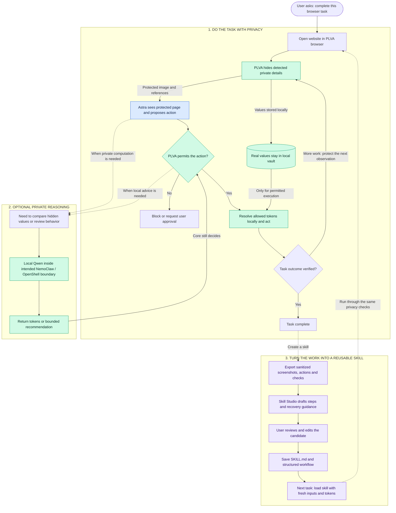

# PLVA: private work becomes a reusable skill

Combined integration flow before branch merge. The private reasoning lane assumes completion of the intended NemoClaw/OpenShell deployment; current handoff still marks it untested. No OpenCL/OpenClaw integration was found.

## Fetched branch evidence

- `codex/plva-demo` at `c214501`: managed Windows Edge, screenshot protection, local token handling and Astra computer tool integration.
- `feat/private-reasoning-module` at `f7804c8`: approval, computation and trace-review service. Handoff reports real Qwen/Astra runs and macOS sandbox-exec tests. NemoClaw/OpenShell remains untested.
- `codex/screenshot-to-skill-studio` at `315cc62`: evidence import, drafting, review/edit/accept, export and next-run preparation. Handoff reports 93 tests. Live Astra synthesis and changed-layout execution remain unmeasured.

Skill drafting currently has a local deterministic path and an optional Astra adapter tested with mocked transport. Review approval does not prove execution success. Reuse requires fresh tokens, current policy and new outcome checks.

No branches were merged. The diagram illustrates how the workstreams connect after integration; it is not a claim of a verified combined run. Test results above are branch-reported, not rerun for this diagram.

